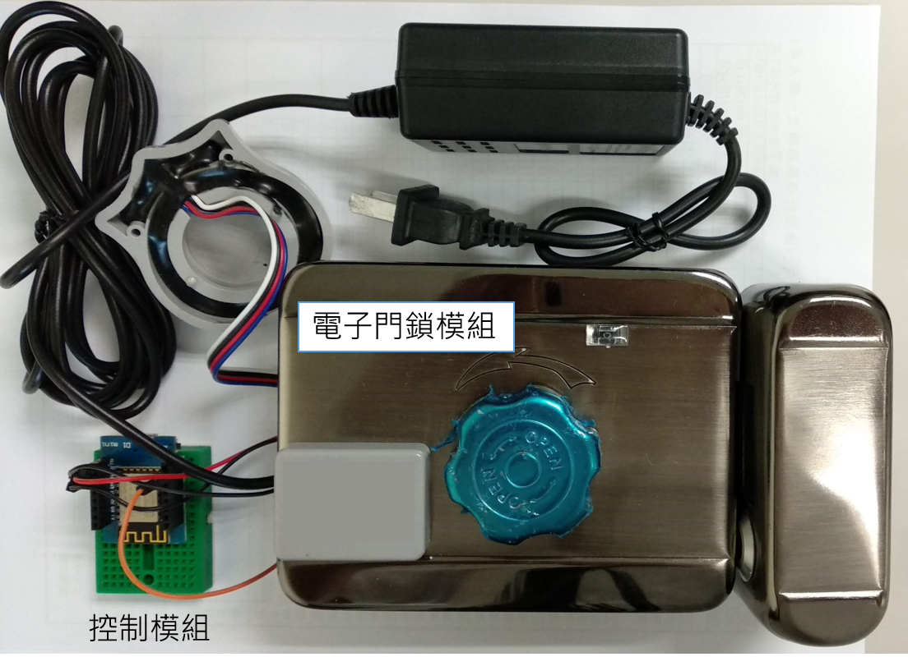

# 旗標科技 AI 積木使用手冊

- 目前版本：0.0.1
- 最新線上版本：[檢視](https://hackmd.io/@hOQoxW51THiTMissFY9ZKg/r18oWKoBB)

## AI 積木簡介與架構

AI 可說是當前最熱門的科技, 舉凡學術研究、商業發展, 大家都一致地選擇與 AI 相關的主題。不過想要運用 AI, 並不代表所有的人都必須研究底層技術, 也不必大家都是機器學習高手, 只要能夠善用 AI, 每個人都有機會藉由 AI 實踐新的應用。因此, 旗標科技基於這樣的前提, 開發出 AI 積木教具, 主要依循以下方針：

- **體驗 AI**：AI 時代已經來臨, 但要瞭解 AI, 並不需要每個人都去學習 AI 技術, 只要能夠有適當的教具, 就可以瞭解 AI 可以做到什麼？進而**引發創意**, 想出可能的應用。
- **應用 AI**：許多創客或學生的專題, 都需要 AI 扮演關鍵的輔助角色, 雖然不是主角, 但缺了就不行。只要有適當的教具, 就能**直接應用**, 不需要每個人都從 0 做起, 耗費苦工。
- **獨立運算**：雖然也可藉由各種線上服務資源提供 AI 功能, 但卻必須倚賴網路連線, 受到網路環境限制, 也可能因為服務商後端故障而無法使用。因此, **離線的邊緣運算**為首要選擇。

為了讓 AI 積木教具易於與其他系統或是既有系統串接使用, AI 積木都是以專一功能建構, 並且透過 Wi-Fi 無線網路溝通, 基本的架構如下：


由於主要的溝通管道是 Wi-Fi 無線網路, 並且依循 http 協定, 因此中間的主控端並不受限於特定硬體, 從功能強大的一般電腦, 或是人手一隻的智慧型手機, 甚至是輕薄廉價的可連網微控制器, 都可以用來操控各種輸出/輸入裝置, 也很容易介接到既有的系統中。

舉例來說, 如果介接`AI 及時人臉辨識積木`、手機, 以及`遠端遙控電子門鎖積木`, 就可以構成一個以使用者手機為主控端的人臉解鎖系統, 使用者只要透過手機 App, 即可開啟門口的人臉辨識裝置, 並在取得辨識結果後控制電子鎖解鎖開門, 還可以把使用者的資訊回傳到後端系統, 建構完整的門禁或是出勤管理系統。

## 硬體介紹

旗標 AI 積木教具目前有輸入/輸出裝置各 1 個, 分別是：

1. **AI 即時人臉辨識積木**：由[凌通科技公司](http://www.generalplus.com/) 開發的 GPM4 晶片擔負核心的人臉辨識模組以及接收指令與傳送辨識結果的控制模組所構成。GPM4 晶片具備硬體加速, 可以離線邊緣運算的形式即時進行人臉監測與辨識：

    

1. **遠端遙控電子門鎖積木**﹕由可程式控制的電子門鎖模組與負責接收指令的控制模組所構成, 能夠裝設於真實的門上, 並由程式控制門閂轉動與磁閥開關：

    

## 安裝測試工具

以下工具有助於測試 AI 積木：

1. [curl](https://curl.haxx.se/) 命令列工具：本教具中的個別 AI 積木均是以 http  協定接收指令, 在測試時 curl 可以讓我們很方便的送出 http 請求控制 AI 積木。如果您不習慣使用 curl 工具, 同樣的測試工作也可以使用瀏覽器。

1. [Python3](https://www.python.org/downloads/)：本教具中特定的 AI 積木, 例如 AI 即時人臉辨識積木, 可以讓使用端以 http 伺服器等待 AI 積木主動推播訊息, 像是 AI 即時人臉辨識積木可以在辨識出人臉時, 主動通知使用端辨識出的人臉編號, 而 Python3 可以讓我們建立簡易的 http 伺服器, 接收 AI 積木發出的通知。如果不使用這種方式, 就必須自行撰寫程式或架設伺服器, 對測試階段來說比較麻煩。


## AI 即時人臉辨識積木

### 使用前準備工作

使用 AI 即時人臉辨識積木前, 須先確認控制模組與人臉辨識模組間的接線：

人臉辨識模組|控制模組
-----------|--------
3v3|5v
GND|G
UART1#0TX|D5
UART1#0RX|D6


### 設定無線網路

由於 AI 即時人臉辨識積木必須仰賴 Wi-Fi 無線網路接收指令, 因此使用時的第一步就是設定無線網路。本套件的做法都是讓控制模組建立一個私有的區域無線網路, 並在此網路中架設一個網站, 您可使用手機或具備無線網路功能的電腦連上該無線網路後利用瀏覽器開啟設定網頁, 即可修改設定。以下是詳細的設定步驟：

1. 請插上 Micro-USB 傳輸線供電, 控制板上的藍燈會開始閃爍：

    

1. 使用手機或是具備無線網路的電腦搜尋 "FGPS-" 開頭的無線網路名稱：
    
    

    :exclamation: 名稱尾端的 4 位數 16 進位數字會隨個別的控制模組而不同, 你可以在控制模組的底端看到標示此識別數字的貼紙, 若您手上有多個模組時, 就可以利用識別數字區別各個模組。

    這個無線網路主要的功能是讓使用者可以連接到控制模組的設定網頁, 因此以下都稱此無線網路為『**設定用無線網路**』。

1. 選用此無線網路, 預設的密碼為 12345678：

    

1. 連上此無線網路後, 會顯示登入提示：

    

    :exclamation: 如果沒有看到登入網路的訊息, 可以直接開啟瀏覽器, 並在網址列輸入 http://192.168.4.1。

1. 顯示控制模組的設定頁面：

    

    點選其中的 Config the wifi connection 設定要使用的既有無線網路：

    

    此頁面會列出目前掃描到的無線網路, 請捲到頁面尾端, 輸入您要使用的無線網路名稱與密碼。如果正確連上指定的無線網路, 控制模組的藍色指示燈就會保持點亮, 不再閃爍。

1. 控制模組登入前一步驟輸入的無線網路後, 會更改一開始建立的設定用無線網路的名稱, 因此設定頁面會消失。你可以在無線網路清單中看到新的設定用無線網路名稱：

    

    設定用無線網路的名稱會變成原本的名稱再加上控制模組在剛剛連上的無線網路中的 IP 位址, 方便後續遠端控制 AI 人臉辨識積木。

    確認看到此新名稱後, 就可以將手機或是電腦連到與控制模組剛剛選取的同一個無線網路了。

    :exclamation: 到了這裡, 設定用無線網路的功能主要就是透過新名稱來顯示控制模組的 IP 位址, 往後即使要進入設定頁面, 也不需要連上此設定用無線網路, 只要手機或電腦與控制模組使用同一個無線網路, 就可以透過新名稱所顯示的 IP 位址連上了。

### HTTP API 說明

AI 人臉辨識積木的運作方式是先對要辨識的人臉照相訓練, 之後就可以辨識。控制模組提供一組 HTTP 協定的 API 可以接收遠端指令, 並依據遠端指令動作：

:exclamation: 以下說明舉例時均假設控制模組的 IP 位址為 192.168.100.67。

1. 進入訓練模式：

    ```sh
    http://控制模組IP/train?pwd=控制模組密碼
    ```

    控制模組密碼就是在設定頁面中 Server PWD 欄位所指定的密碼, 預設為 12345678。控制模組收到指令後會依循下列規則回覆：
    
    處理結果|狀態碼|回覆內容
    ----|-----|----
    指令無誤|200|"OK"
    密碼錯誤|401|"No password or wrong password."

    :pencil2:範例：
    
    ```sh
    D:\temp>curl http://192.168.100.67/train?pwd=12345678
    OK
    ```

    進入訓練模式後, LCD 左上角會出現 "Face Training" 字樣：

    

    此時請將臉靠近相機鏡頭, 當偵測到人臉時就會出現偵測框, 如果臉部特徵夠明顯, 就會記錄成 1 個樣本, 每張人臉都要取得 10 個樣本才能完成訓練：

    

    訓練完成的臉會依序編序號, 後續辨識時就以序號為辨識結果。

1. 進入辨識模式：

    ```sh
    http://控制模組IP/recog?pwd=控制模組密碼
    ```

    控制模組收到指令後會依循下列規則回覆：
    
    處理結果|狀態碼|回覆內容
    ----|-----|----
    指令無誤|200|"OK"
    密碼錯誤|401|"No password or wrong password."

    :pencil2:範例：

    ```sh
    D:\temp>curl http://192.168.100.67/recog?pwd=12345678
    OK
    ```

    進入辨識模式後, 會看到左上角出現 "Face Identify Start" 字樣：

    

    此時只要將臉對著照相機, 偵測到人臉時就會出現偵測框, 如果比對人臉特徵與已訓練的人臉相符, 就會出現解鎖圖示：

    

1. 查詢剛剛訓練完成或是辨識出的人臉編號：

    ```sh
    http://控制模組IP/faceid?pwd=控制模組密碼
    ```

    控制模組收到指令後會依循下列規則回覆：
    
    處理結果|狀態碼|回覆內容
    ----|-----|----
    上次詢問後沒有訓練完成或是辨識出的人臉編號|200|0
    上次詢問後有辨識出人臉|200|正數
    上次詢問後有新訓練完成的人臉|200|負數：
    密碼錯誤|401|"No password or wrong password."

    要注意的是, 詢問後就會清除紀錄的人臉編號, 如果發出詢問指令後沒有再訓練新的人臉或是辨識出人臉, 再次詢問就會取得 0。

    :pencil2:範例：

    ```sh
    D:\temp>curl http://192.168.100.67/faceid?pwd=12345678
    1
    D:\temp>curl http://192.168.100.67/faceid?pwd=12345678
    0
    D:\temp>curl http://192.168.100.67/faceid?pwd=12345678
    -1
    ```

    第 1 次回覆結果是 1, 表示辨識出序號 1 的人臉；第 2 次詢問取得 0, 表示兩次詢問之間沒有再訓練新的人臉或是辨識出人臉。第 3 次詢問得到 -1, 表示剛剛有訓練過新的人臉, 序號為 1。

1. 前面介紹的查詢指令必須仰賴遙控端不斷查詢結果, 如果發出命令的遙控端可以建立 HTTP 伺服器, 那麼也可以在控制模組登記掛勾 (hook), 由 AI 人臉辨識積木主動通知人臉訓練或是辨識結果。要建立掛勾, 遙控端必須能夠處理 HTTP GET 請求。建立掛鉤的指令如下：

    ```sh
    http://控制模組IP/hook?pwd=控制模組密碼
    ```

    控制端收到指令後會記錄遙控端的 IP 位址, 並會依循下列規則回覆：
    
    處理結果|狀態碼|回覆內容
    ----|-----|----
    指令無誤|200|"OK"
    密碼錯誤|401|"No password or wrong password."

    建立掛勾後, 控制端會以如下的 HTTP 請求主動通知新訓練完成或是辨識出的人臉序號：

    ```sh
    http://遙控端IP/faceid?pwd=控制端密碼&id=人臉序號
    ```

    遙控端可以透過收到的控制端密碼確認此通知的確是由之前建立掛勾的控制端發出, 而 id 就是依循查詢指令的規則, 負數代表是新訓練完成的人臉編號、正數代表辨識出的人臉編號。控制模組發出通知後, 一樣會清除紀錄的人臉編號, 如果遙控端再使用查詢指令詢問人臉編號, 就會取得 0。

    :pencil2:範例：

    舉例來說, 我們可以在電腦上先用 Python3 建立一個簡易的 HTTP 伺服器：

    ```sh
    D:\temp>py -m http.server 80
    Serving HTTP on 0.0.0.0 port 80 (http://0.0.0.0:80/) ...
    ```

    接著, 就可以下指令在控制模組上建立掛勾：

    ```sh
    C:\Users\ShinWei>curl http://192.168.100.67/hook?pwd=12345678
    OK
    ```

    然後就可以下達指令辨識人臉：

    ```sh
    C:\Users\ShinWei>curl http://192.168.100.67/recog?pwd=12345678
    OK
    ```

    由於遙控端已經建立掛勾, 所以不再需要使用查詢指令像控制模組查詢結果, 一旦有新訓練完成的人臉或是辨識出的人臉, 控制模組就會主動通知：

    ```sh
    192.168.100.67 - - [03/Sep/2019 17:23:56] code 404, message File not found
    192.168.100.67 - - [03/Sep/2019 17:23:56] "GET /faceid?pwd=12345678&id=1 HTTP/1.1" 404 -
    ```

    由於 Python3 建立的 HTTP 簡易伺服器只是單純地將請求路徑對應到啟動時所在位置的資料夾路徑, 因此當它收到控制模組發出的通知請求時, 會因為找不到 faceid 資料夾而顯示錯誤, 這就是 File not found 訊息出現的原因, 不過你可以從最後一行看到請求路徑, 這裡 id=1 就是通知遙控端剛剛辨識出序號為 1 的人臉了。

## 遠端遙控電子門鎖積木

### 使用前準備工作

使用遠端遙控電子門鎖積木前, 須先確認控制模組與電子門鎖模組間的接線：

電子門鎖模組|控制模組
-----------|--------
5V|5V
GND|G
K-|G
K+|D8


### 設定無線網路

由於電子門鎖積木必須仰賴 Wi-Fi 無線網路接收指令, 因此使用時的第一步就是設定無線網路。本套件的做法都是讓控制模組建立一個私有的區域無線網路, 並在此網路中架設一個網站, 您可使用手機或具備無線網路功能的電腦連上該無線網路後利用瀏覽器開啟設定網頁, 即可修改設定。以下是詳細的設定步驟：

1. 請插上電子門鎖模組的電源供應器, 控制模組上的藍燈會開始閃爍, 電子門鎖模組上的藍色電源也會亮起：

    

1. 使用手機或是具備無線網路的電腦搜尋 "FLCK-" 開頭的無線網路名稱：
    
    

    :exclamation: 名稱尾端的 4 位數 16 進位數字會隨個別的控制模組而不同, 你可以在控制模組的底端看到標示此識別數字的貼紙, 若您手上有多個模組時, 就可以利用識別數字區別各個模組。

    這個無線網路主要的功能是讓使用者可以連接到控制模組的設定網頁, 因此以下都稱此無線網路為『**設定用無線網路**』。

1. 選用此無線網路, 預設的密碼為 12345678：

    

1. 連上此無線網路後, 會顯示登入提示：

    

    :exclamation: 如果沒有看到登入網路的訊息, 可以直接開啟瀏覽器, 並在網址列輸入 http://192.168.4.1。

1. 顯示控制模組的設定頁面：

    

    點選其中的 Config the wifi connection 設定要使用的既有無線網路：

    

    此頁面會列出目前掃描到的無線網路, 請捲到頁面尾端, 輸入您要使用的無線網路名稱與密碼。如果正確連上指定的無線網路, 控制模組的藍色指示燈就會保持點亮, 不再閃爍。

1. 控制模組登入前一步驟輸入的無線網路後, 會更改一開始建立的設定用無線網路的名稱, 因此設定頁面會消失。你可以在無線網路清單中看到新的設定用無線網路名稱：

    

    設定用無線網路的名稱會變成原本的名稱再加上控制模組在剛剛連上的無線網路中的 IP 位址, 方便後續遠端控制 AI 人臉辨識積木。

    確認看到此新名稱後, 就可以將手機或是電腦連到與控制模組剛剛選取的同一個無線網路。

    :exclamation: 到了這裡, 設定用無線網路的功能主要就是透過新名稱來**顯示控制模組的 IP 位址**, 往後即使要進入設定頁面, 也不需要連上此設定用無線網路, 只要手機或電腦與控制模組使用同一個無線網路, 就可以透過新名稱所顯示的 IP 位址連上了。

### HTTP API 說明

電子門鎖積木只提供開鎖的功能, 開鎖之後就必須依賴使用者自行將門鎖上：

:exclamation: 以下說明舉例時均假設控制模組的 IP 位址為 192.168.100.82。

1. 開鎖：

    ```sh
    http://控制模組IP/unlock?pwd=控制模組密碼
    ```

    控制模組密碼就是在設定頁面中 Server PWD 欄位所指定的密碼, 預設為 12345678。控制模組收到指令後會依循下列規則回覆：
    
    處理結果|狀態碼|回覆內容
    ----|-----|----
    指令無誤|200|"OK"
    密碼錯誤|401|"No password or wrong password."

    :pencil2:範例：
    
    ```sh
    D:\temp>curl http://192.168.100.67/train?pwd=12345678
    OK
    ```

    開鎖時會聽到馬達轉到的聲音, 以及一聲『嗶』。

2. 上鎖：

    上鎖無法使用程式控制, 必須由使用者將門靠上, 門鎖與門框上的磁鐵感應後, 就會自動上鎖：

        
